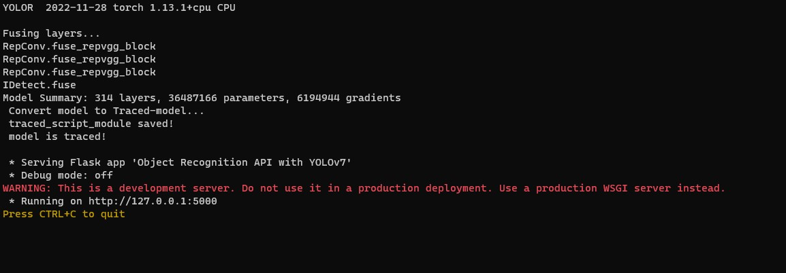

# Object Detection API in Flask using YOLOv7

## This API if for a project to count strawberry flowers. For that we use [YOLOv7](https://github.com/WongKinYiu/yolov7)

## How to use the API
### 1. Fisrt git clone this repository:
```
git clone https://github.com/DavidSilTroy/python_API_Strawberry-flowers-recognition.git
```
### 2. Once it is downloaded, you have to go inside the folder and install the libraries:
```
pip install -r ./requirements.txt
```
### 3. IMPORTANT! in the folder of the API you should paste you model.pt, this api now is using 'rtrain-2.pt' by default. To use you model you can modify the app.py:
```
y7_model = obj_detection.Initialization(weights='yourModel.pt')
```
### 4. Now run the main.py or app.py, both works:
```
python ./main.py
```
You should be able to see something like this:
<p style="text-align:center;">

</p>

### 5. For sending the pictures you can do it with postman in file or in base64 with the body as json:

<ul>
    <li>
        <h3>
            Sending the <b>picture</b> to the http://localhost:5000/api/image-strawberry? and receiving a picture.
        </h3>
        <p style="text-align:center;">
            
        </p>
    </li>
    <li>
        <h3>
            Sending the <b>base64 picture</b>  to the http://localhost:5000/api/image-strawberry? and receiving a picture.
        </h3>
        <p style="text-align:center;">
            
        </p>
    </li>
    <li>
        <h3>
            Sending the <b>picture</b>  to the http://localhost:5000/api/data-strawberry? and receiving a json.
        </h3>
        <p style="text-align:center;">
            
        </p>
    </li>
    <li>
        <h3>
            Sending the <b>base64 picture</b>  to the http://localhost:5000/api/data-strawberry? and receiving a json.
        </h3>
        <p style="text-align:center;">
            
        </p>
    </li>
</ul>

And now you can also use your app in the internet with [localtunnel](https://github.com/localtunnel/localtunnel) ;)

And extra, this is one way to use JavaScript to request the API:
```javascript
let base64String = "Here your base64 string from the image"

fetchRes = fetch('https:strawberrydev6.loca.lt/api/data-strawberry', {
    method: 'POST',
    headers: {
        Accept: '*/*',
        'Content-Type': 'application/json',
    },
    body: JSON.stringify({
        "image": base64String
    }),
    //Cross-Origin Resource Sharing (CORS) 
    mode: "cors", 
});

//To see the result
fetchRes.then(res =>
    res.json()).then(d => {
        console.log(d)
}) 
```

Thank you!  </br>
[www.davidsiltroy.com](https://davidsiltroy.com/)
